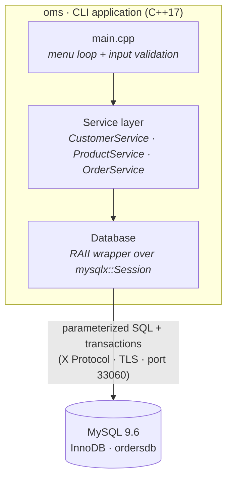
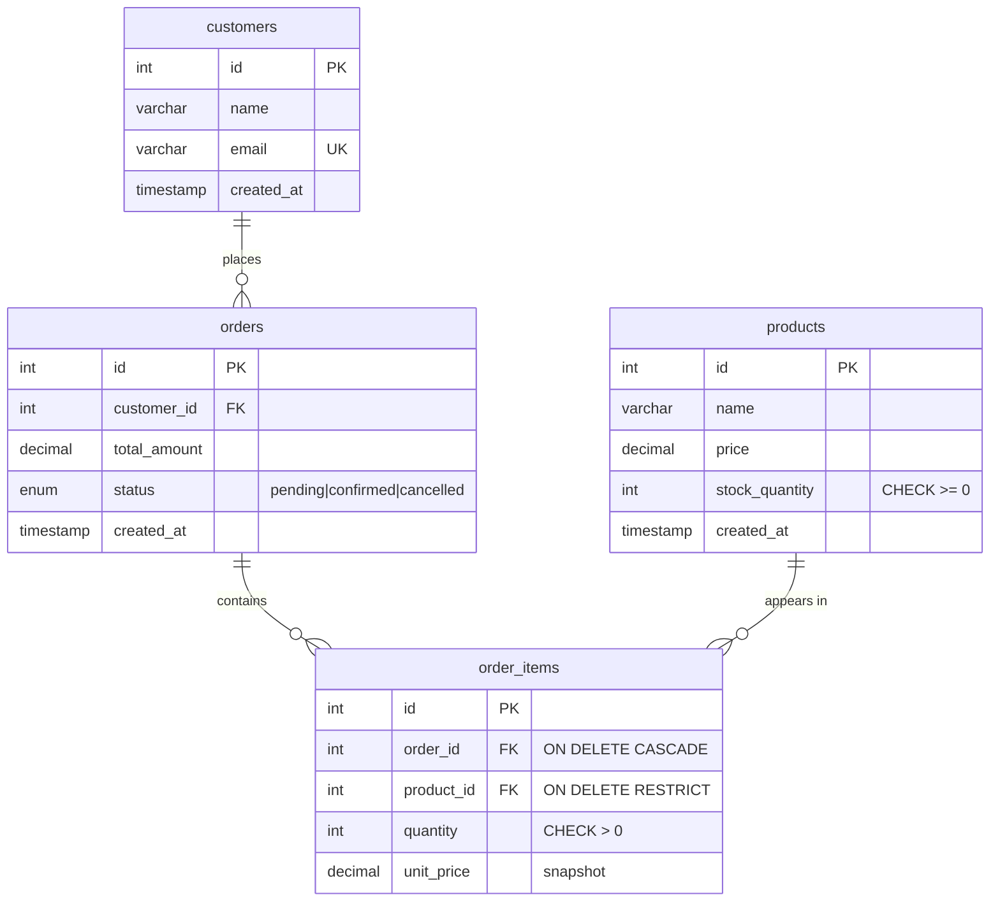

<div align="center">

# 📦 Order Management System

**A command-line Order Management System in modern C++, backed by MySQL —
with atomic, all-or-nothing order placement.**


</div>

---

## Overview

A small shop modelled end-to-end: **customers**, **products** with stock, and
**orders** made of line items. The headline feature is **atomic order placement** —
an order either fully succeeds (items recorded, stock decremented, total computed)
or, if any product is short on stock, the **entire operation rolls back** and the
database is left exactly as it was. No half-finished orders, ever.

It's a deliberately focused project: a clean 3NF schema, a thin RAII connection
wrapper, parameterized queries throughout, and one real database transaction at the
core — each chosen so every decision is simple to explain.

## ✨ Highlights

- 🔒 **Atomic transactions** — `placeOrder` runs inside one transaction with
  `commit`/`rollback`; a partial order can never be persisted.
- 🛡️ **SQL-injection safe** — every query that touches user input uses bound
  parameters (`.bind()`), never string concatenation.
- 🧱 **3NF relational schema** — four InnoDB tables with foreign keys, `ON DELETE`
  rules, and `CHECK` constraints; a junction table resolves the orders↔products
  many-to-many.
- 💰 **Correct money** — `DECIMAL` everywhere (never `FLOAT`); `unit_price` is
  snapshotted per line so historical orders stay accurate.
- ♻️ **RAII resource management** — the DB connection is opened and closed by an
  object's lifetime; it can't leak.
- 🧰 **Layered design** — presentation (`main`) → services → connection wrapper.

## 🏗️ Architecture



| Layer | Responsibility |
|-------|----------------|
| `main.cpp` | Text menu, input validation, output formatting — **no SQL** |
| Service classes | Data access per entity; all queries parameterized; `placeOrder` runs the transaction |
| `Database` | Owns the connection (RAII), exposes `run()` + transaction control |

## 🗄️ Database schema

Third normal form. `order_items` is the **junction table** resolving the
many-to-many between `orders` and `products`, and it snapshots `unit_price`.



## 🧰 Tech stack

| | |
|---|---|
| **Language** | C++17 |
| **Database** | MySQL 9.6 (InnoDB engine) |
| **DB access** | MySQL Connector/C++ 9.7 — X DevAPI (`mysqlx::Session`) |
| **Build** | CMake (`find_package` + imported targets) |
| **Platform** | macOS / Homebrew (project-local MySQL instance) |

## 🚀 Getting started

> **Prerequisites** (macOS): `brew install cmake mysql mysql-connector-c++`
> The database runs as a **project-local** instance (data in `db/data/`, classic
> port `3307`, X Protocol port `33060`) — started/stopped manually, never as a
> system service.

```bash
# 1) Start the project-local MySQL instance
./db/start-db.sh

# 2) First time only — create the database + least-privilege app user (as root)
SOCK="$(pwd)/db/mysql.sock"
/opt/homebrew/opt/mysql/bin/mysql --socket="$SOCK" -u root <<'SQL'
CREATE DATABASE IF NOT EXISTS ordersdb CHARACTER SET utf8mb4;
CREATE USER IF NOT EXISTS 'orderapp'@'%' IDENTIFIED BY 'orderpass';
GRANT SELECT, INSERT, UPDATE, DELETE ON ordersdb.* TO 'orderapp'@'%';
SQL

# 3) Apply schema + seed data
/opt/homebrew/opt/mysql/bin/mysql --socket="$SOCK" -u root ordersdb < db/schema.sql
/opt/homebrew/opt/mysql/bin/mysql --socket="$SOCK" -u root ordersdb < db/seed.sql

# 4) Build & run
cmake -S . -B build
cmake --build build
./build/oms

# When finished
./db/stop-db.sh
```

## ▶️ See the headline feature

Request more of a product than is in stock, and the order is rejected **with the
stock left completely untouched** — that's the transaction rolling back:

```text
=== Order Management System ===
5. Place order
Choose an option: 5
  Customer id: 1
  Add line items (enter product id 0 to finish):
    Product id (0 to finish): 4
    Quantity: 10
    Product id (0 to finish): 0
  Error: Insufficient stock for 'Webcam 1080p': have 3, need 10.
```

Re-list the products afterwards: stock is unchanged, and no `pending` order row was
left behind. A successful order instead decrements stock, snapshots each price, sets
the total, and marks the order `confirmed` — all in one commit.

## 🧠 Design decisions

<details open><summary><b>Why these choices (the "why did you do it this way?" answers)</b></summary>

- **`DECIMAL(10,2)` for money, never `FLOAT`.** Binary floating point can't
  represent values like `0.10` exactly, so sums drift by fractions of a cent.
  `DECIMAL` is exact base-10 fixed point — correct for currency.
- **Parameterized queries everywhere (`.bind()`).** User input is sent to the
  server separately from the SQL text, so it can never be parsed as SQL — this
  structurally eliminates SQL injection (vs. building queries by concatenation).
- **Order placement is one transaction.** Inserting the order, inserting each line
  item, and decrementing stock must happen together. `startTransaction … commit`
  with `rollback` on failure gives **atomicity**: the DB is never left with a
  half-finished order.
- **Stock guarded twice.** The app checks stock before each decrement (for a clear
  message), and a `CHECK (stock_quantity >= 0)` constraint backs it up at the
  database level — even a logic bug or a race can't drive stock negative.
- **`unit_price` is snapshotted** into `order_items` at order time, so past orders
  remain accurate if a product's price later changes.
- **Least-privilege DB user.** The app connects as `orderapp`, which has only
  `SELECT/INSERT/UPDATE/DELETE` on `ordersdb` — no DDL, no other databases. Limits
  the blast radius if the app is ever compromised.
- **RAII connection wrapper.** `Database` opens the session in its constructor and
  closes it in the destructor, so the connection is always released — even when an
  exception unwinds the stack.

</details>

## 📁 Project layout

```text
oms/
├── CMakeLists.txt          # build recipe (connector + keg-only OpenSSL fix + RPATH)
├── README.md
├── db/
│   ├── schema.sql          # tables, keys, constraints (re-runnable)
│   ├── seed.sql            # sample customers + products
│   ├── start-db.sh         # start the project-local MySQL instance
│   └── stop-db.sh          # stop it
└── src/
    ├── main.cpp            # menu loop + I/O
    ├── Database.{h,cpp}    # RAII session wrapper + parameterized run() + txn control
    ├── CustomerService.{h,cpp}
    ├── ProductService.{h,cpp}
    └── OrderService.{h,cpp}   # listOrders() + atomic placeOrder()
```
