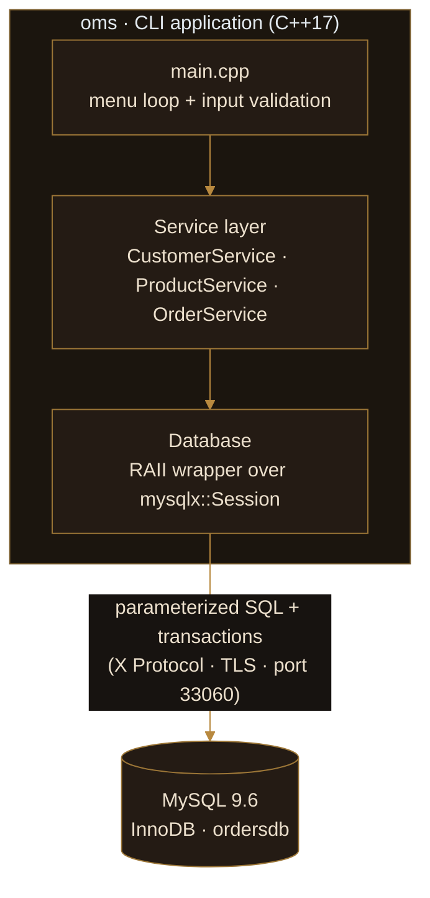
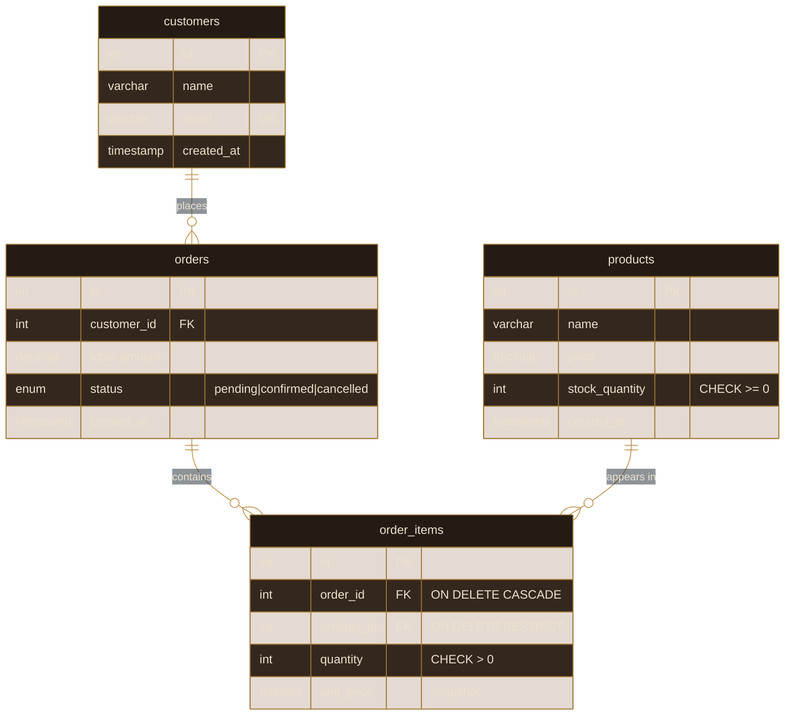

# Order Management System

A CLI order management backend written in C++17 on top of MySQL. The main goal
was to prevent overselling: order placement runs as a single transaction, so an
order either commits fully (line items written, stock decremented, total
computed) or rolls back and leaves the database untouched.


## Features

- 3NF schema across `customers`, `products`, `orders`, and an `order_items`
  junction table, with foreign keys and per-relationship `ON DELETE` rules
  (CASCADE for order lines, RESTRICT for customers/products referenced by
  history).
- Atomic order placement: order creation, line-item inserts, and stock
  decrements happen inside one InnoDB transaction with rollback on any failure,
  e.g. insufficient stock.
- All queries that take user input use bound parameters, never string
  concatenation, and the app connects through a DML-only MySQL account instead
  of root.
- Money is stored and summed as `DECIMAL` in SQL (the total is computed by the
  database, not in C++ floating point). A `CHECK (stock_quantity >= 0)`
  constraint backs up the application-level stock check.
- The database connection lives in an RAII wrapper, so it closes even when an
  exception unwinds the stack.
- An end-to-end test script drives the CLI through a valid order and an
  oversell attempt and asserts the resulting database state.

## Architecture


```mermaid
%%{init: {'theme':'base','themeVariables':{'background':'#171310','primaryColor':'#241b14','primaryBorderColor':'#9c7637','primaryTextColor':'#ece0cd','lineColor':'#b8893f','secondaryColor':'#2a2017','tertiaryColor':'#1d1610','clusterBkg':'#1b150e','clusterBorder':'#7a5e2f','edgeLabelBackground':'#171310','textColor':'#d8c7a4','fontFamily':'ui-sans-serif, system-ui, sans-serif'}}}%%
flowchart TD
    subgraph app["oms · CLI application (C++17)"]
        direction TB
        M["main.cpp<br/>menu loop + input validation"]
        S["Service layer<br/>CustomerService · ProductService · OrderService"]
        D["Database<br/>RAII wrapper over mysqlx::Session"]
        M --> S --> D
    end
    D -->|"parameterized SQL + transactions<br/>(X Protocol · TLS · port 33060)"| DB[("MySQL 9.6<br/>InnoDB · ordersdb")]
```

| Layer | Responsibility |
|-------|----------------|
| `main.cpp` | Text menu, input validation, output formatting. No SQL here. |
| Service classes | Data access per entity; all queries parameterized; `placeOrder` runs the transaction |
| `Database` | Owns the connection (RAII), exposes `run()` + transaction control |

## Database schema

`order_items` is the junction table for the many-to-many between `orders` and
`products`. It snapshots `unit_price` at order time, and a
`UNIQUE(order_id, product_id)` constraint allows one line per product per
order. `orders.total_amount` is also a stored snapshot: like `unit_price`, it
records what was actually charged, which is why it is kept even though it can
be derived from the line items.


```mermaid
%%{init: {'theme':'base','themeVariables':{'background':'#171310','primaryColor':'#241b14','primaryBorderColor':'#9c7637','primaryTextColor':'#ece0cd','lineColor':'#b8893f','mainBkg':'#241b14','nodeBorder':'#9c7637','attributeBackgroundColorOdd':'#221a12','attributeBackgroundColorEven':'#1b140d','textColor':'#ece0cd','fontFamily':'ui-sans-serif, system-ui, sans-serif'}}}%%
erDiagram
    customers   ||--o{ orders      : places
    orders      ||--o{ order_items : contains
    products    ||--o{ order_items : "appears in"

    customers {
        int id PK
        varchar name
        varchar email UK
        timestamp created_at
    }
    products {
        int id PK
        varchar name
        decimal price
        int stock_quantity "CHECK >= 0"
        timestamp created_at
    }
    orders {
        int id PK
        int customer_id FK
        decimal total_amount
        enum status "pending|confirmed|cancelled"
        timestamp created_at
    }
    order_items {
        int id PK
        int order_id FK "ON DELETE CASCADE"
        int product_id FK "ON DELETE RESTRICT"
        int quantity "CHECK > 0"
        decimal unit_price "snapshot"
    }
```

## Tech stack

| | |
|---|---|
| Language | C++17 |
| Database | MySQL 9.6 (InnoDB) |
| DB access | MySQL Connector/C++ 9.7, X DevAPI (`mysqlx::Session`) |
| Build | CMake (`find_package` + imported targets) |
| Platform | macOS / Homebrew (project-local MySQL instance) |

## Getting started

Prerequisites (macOS): `brew install cmake mysql mysql-connector-c++`

The database runs as a project-local instance (data lives in `db/data/`,
classic port 3307, X Protocol port 33060). It is started and stopped manually,
not installed as a system service.

```bash
# 1) Start the project-local MySQL instance
./db/start-db.sh

# 2) First time only: create the database + app user (as root)
SOCK="$(pwd)/db/mysql.sock"
/opt/homebrew/opt/mysql/bin/mysql --socket="$SOCK" -u root <<'SQL'
CREATE DATABASE IF NOT EXISTS ordersdb CHARACTER SET utf8mb4;
CREATE USER IF NOT EXISTS 'orderapp'@'%' IDENTIFIED BY 'orderpass';
GRANT SELECT, INSERT, UPDATE, DELETE ON ordersdb.* TO 'orderapp'@'%';
SQL

# 3) Apply schema + seed data
/opt/homebrew/opt/mysql/bin/mysql --socket="$SOCK" -u root ordersdb < db/schema.sql
/opt/homebrew/opt/mysql/bin/mysql --socket="$SOCK" -u root ordersdb < db/seed.sql

# 4) Build & run
cmake -S . -B build
cmake --build build
./build/oms

# When finished
./db/stop-db.sh
```

Connection settings are read from `OMS_DB_HOST`, `OMS_DB_PORT`, `OMS_DB_USER`,
`OMS_DB_PASSWORD`, and `OMS_DB_NAME`, falling back to the local-dev values
above, so no credentials are baked into the binary.

## Testing

```bash
./scripts/verify.sh
```

Resets the schema and seed data, builds, then drives the CLI through a valid
order and an oversell attempt. It asserts the final stock numbers, the order
count, and the exact `DECIMAL` total queried from SQL, which checks both the
commit path and the rollback path.

## Rollback demo

Ordering more than the available stock rejects the order and leaves stock
untouched:

```text
=== Order Management System ===
5. Place order
Choose an option: 5
  Customer id: 1
  Add line items (enter product id 0 to finish):
    Product id (0 to finish): 4
    Quantity: 10
    Product id (0 to finish): 0
  Error: Insufficient stock for 'Webcam 1080p': have 3, need 10.
```

Listing products afterwards shows unchanged stock, and no `pending` order row
is left behind. A successful order decrements stock, snapshots each price,
sets the total, and marks the order `confirmed` in one commit.

## Design notes

- `DECIMAL(10,2)` for money instead of `FLOAT`: binary floating point cannot
  represent values like 0.10 exactly, so sums drift. `DECIMAL` is exact
  fixed-point. For the same reason the order total is summed by the database
  over the DECIMAL columns rather than accumulated in a C++ double.
- Parameterized queries: user input travels to the server separately from the
  SQL text, so it is never parsed as SQL. This removes the injection class of
  bugs rather than filtering for it.
- One transaction for order placement, because the order row, its line items,
  and the stock updates only make sense together. Any failure inside the block
  triggers `rollback` and the caller just sees the error message.
- Stock is guarded twice: the application checks stock first so the user gets a
  readable message, and the `CHECK` constraint means that even a bug or a race
  could not push stock below zero. The same pattern is used for duplicate
  emails (application pre-check for the message, `UNIQUE` for the guarantee).
- The app connects as `orderapp`, which has only SELECT/INSERT/UPDATE/DELETE on
  `ordersdb`. Schema changes are done as root; a compromised app account cannot
  drop tables or touch other databases.
- The `Database` class opens the session in its constructor and relies on the
  destructor to close it, so cleanup also happens when an exception propagates.

## Limitations / future work

The scope is a single-user CLI, so several things are intentionally not built:

- Concurrency: two clients could both pass the in-app stock check for the same
  units. The data would still end up correct (row locks serialize the updates
  and the `CHECK` constraint rolls the loser back), but the failing client gets
  a raw constraint error. Handling this properly means `SELECT ... FOR UPDATE`
  on the product rows during order placement.
- Connection pooling: the app holds one connection for its whole session, which
  would not survive many concurrent users.
- Pagination: `listOrders` returns the full history, which needs `LIMIT`/keyset
  pagination once the table grows.

## Project layout

```text
oms/
├── CMakeLists.txt          # build recipe (connector + keg-only OpenSSL fix + RPATH)
├── README.md
├── db/
│   ├── schema.sql          # tables, keys, constraints (re-runnable)
│   ├── seed.sql            # sample customers + products
│   ├── start-db.sh         # start the project-local MySQL instance
│   └── stop-db.sh          # stop it
├── scripts/
│   └── verify.sh           # end-to-end commit/rollback test
└── src/
    ├── main.cpp            # menu loop + I/O
    ├── Database.{h,cpp}    # RAII session wrapper + parameterized run() + txn control
    ├── CustomerService.{h,cpp}
    ├── ProductService.{h,cpp}
    └── OrderService.{h,cpp}   # listOrders() + atomic placeOrder()
```
